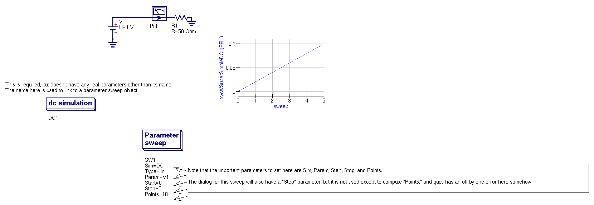

This really simple schematic shows how to do DC sweeps in Qucs.

Qucs does not provide a "DC Simulation" object that matches SPICE's
(or Xyce's).  Instead, you add a "DC Simulation" object that has
almost no parameters of any value to us, and a second "Parameter
Sweep" object.  The "Sim" parameter of this parameter sweep object
should be the name of the DC Simulation object you placed (you choose
it from a drop-down menu, so it's easy to select).

Then you use the name of the voltage source you want to sweep over in
the "Param" parameter of the sweep.

Put the start, stop, and number of points into the appropriate boxes.

### There was a bug in versions of qucs-s up to 0.0.20

This demo works as intended in version 0.0.21 of qucs-s.  However, there
was a bug in the netlist generation step of previous versions of
qucs-s for parameter sweeps, documented in
https://github.com/ra3xdh/qucs_s/issues/8.  While the dialog box for
setting up the parameter sweep object correctly computes the step size
from the number of points, or the number of points from the step size,
there is an off-by-one error in the netlist generation stage which
incorrectly computes the parameter sweep step from the number of
points chosen.  

If you are a version of qucs-s older than 0.0.21, you will have to
modify the parameter sweep to get it to generate a netlist that takes
the intended number of steps.  Ignore the "step" value in the
parameter sweep dialog, as Qucs-s doesn't use it to generate the
netlist, and will compute the step from (stop-start)/points instead of
(stop-start)/(points-1).  Therefore, you need to set "Number" in the
dialog to one fewer point than you actually want in order to get the
netlist generation correct.  In this demo, we want to sweep V1 from 0
to 5 in steps of .5, which would normally be 11 steps (0.0, 0.5, 1.0,
1.5, ... 4.5, 5.0), but you can see in the schematic that we use
Points=10 instead.

### Xyce and SPICE support DC lines that Qucs schematics don't do natively

Qucs does NOT have any way to generate netlists with multi-parameter
DC sweeps of the form:

   .DC V1 1 2 3 V2 4 5 6

Further, Xyce does not support having more than one .DC line in a
netlist, so if you need to do nested DC sweeps like this, you must do
it in an "Xyce Script," which allows you to hand-code the analysis and
print statements instead of using Qucs-s components to generate them.

### Exported schematic image

